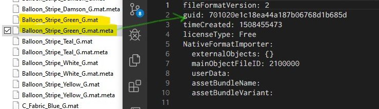

# Unity GUID Mapper
Show/List/Replace assets with specified GUID for Unity 3D.

## Usage
* `dotnet uguid.dll -show <AssetFile>` Show the GUID for the asset file.
* `dotnet uguid.dll -list <AssetsDirectory> <Guid>` Lists assets that uses given GUID asset.
* `dotnet uguid.dll -replace <AssetsDirectory> <OldGuid> <NewGuid>` Replaces assets that uses given GUID with the new one.

## How to know GUID of an asset?
You can access GUID of an asset by its .meta file:

